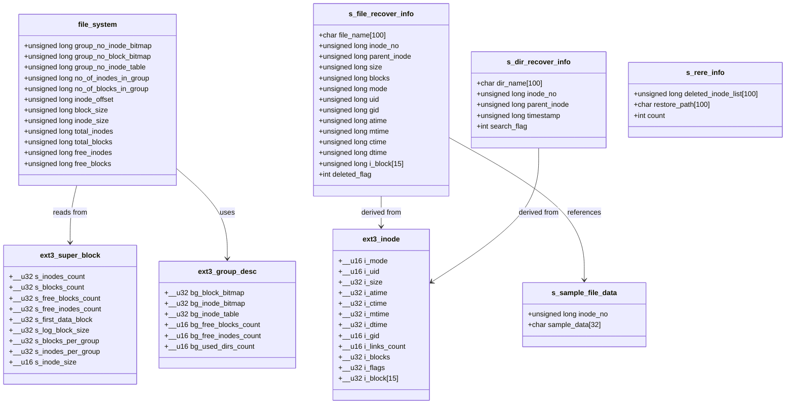

# GIIS - Architecture Diagram

## Project Overview
**GIIS (gET iT i sAY)** is a text-based file recovery tool for Ext2/Ext3 file systems on Linux. It works by creating a snapshot of file metadata during installation, which is then used to recover deleted files.

---

## System Architecture


---

## Component Interaction Diagram


---

## Data Flow Diagram


---

## Module Dependency Diagram


---

## Data Structure Diagram



---

## File System Interaction Diagram


---

## Deployment Diagram

```mermaid
graph TB
    subgraph "Linux System"
        subgraph "User Space"
            BINARY[/usr/bin/giis<br/>Executable]
            CONFIG[/etc/giis.conf<br/>Configuration]

            subgraph "/usr/share/giis/"
                SYS_DIR[sys/dir<br/>Directory DB]
                SYS_FILE[sys/file<br/>File DB]
                SYS_SIND[sys/sind<br/>Single Indirect DB]
                SYS_DIND[sys/dind<br/>Double Indirect DB]
                SYS_SAMPLE[sys/sample<br/>Sample Data DB]
                GOT_IT[got_it/<br/>Recovered Files]
                UNREC[unrecovered/<br/>Failed Recovery List]
            end

            CRON[/etc/cron.d/<br/>Auto-update Job]
        end

        subgraph "Kernel Space"
            VFS[Virtual File System]
            EXT3[Ext3 Driver]
        end

        subgraph "Hardware"
            DISK[/dev/sdaX<br/>Physical Disk]
        end
    end

    BINARY --> CONFIG
    BINARY --> SYS_DIR
    BINARY --> SYS_FILE
    BINARY --> SYS_SIND
    BINARY --> SYS_DIND
    BINARY --> SYS_SAMPLE
    BINARY --> GOT_IT
    BINARY --> UNREC

    CRON -->|Every 20 min| BINARY

    BINARY -->|System Calls| VFS
    VFS --> EXT3
    EXT3 --> DISK

    style BINARY fill:#e1f5ff
    style CONFIG fill:#fff4e1
    style GOT_IT fill:#d4edda
    style DISK fill:#f0f0f0
```

---

## Recovery Algorithm Flowchart


---

## State Diagram


---

## Technology Stack


---

## Configuration and Workflow


---

## Key Design Principles

1. **Snapshot-Based Recovery**: GIIS takes periodic snapshots of filesystem metadata, allowing recovery of files deleted after installation.

2. **Non-Invasive**: The tool reads filesystem structures directly but doesn't modify them during recovery, ensuring safety.

3. **Sample-Based Verification**: Stores first 32 bytes of each file to detect if data has been overwritten.

4. **Modular Architecture**: Clear separation between filesystem operations, data management, and recovery logic.

5. **Efficient Updates**: Cron-based auto-updates only record new/modified files to minimize overhead.

6. **Direct Block Access**: Bypasses the normal file I/O layer to read data from freed inodes.

7. **Flexible Configuration**: Users can specify directories to protect and update frequency.

---

## Limitations

- **Pre-Installation Requirement**: Cannot recover files deleted before GIIS was installed
- **Filesystem Support**: Only works with Ext2/Ext3 (not Ext4, Btrfs, XFS, etc.)
- **Overwrite Detection**: If data blocks are reused, recovery may fail or produce corrupted data
- **Root Access Required**: Needs direct device access to read raw filesystem structures
- **Snapshot Overhead**: Requires periodic scanning and storage of metadata
- **Directory Depth Limit**: Configurable maximum depth (default 10 levels)

---

## Future Enhancement Possibilities

1. Support for Ext4 filesystem
2. GUI interface for easier usage
3. Selective directory monitoring to reduce overhead
4. Compression of snapshot data
5. Network-based recovery for remote systems
6. Integration with filesystem events (inotify) for real-time tracking
7. Support for encrypted filesystems
8. Multi-threaded recovery for faster performance

---

*Generated: 2025-11-07*
*Version: GIIS 4.6.1*
*Author: Lakshmipathi.G*
